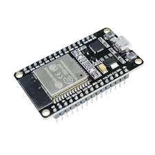
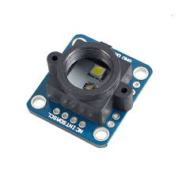
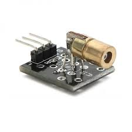
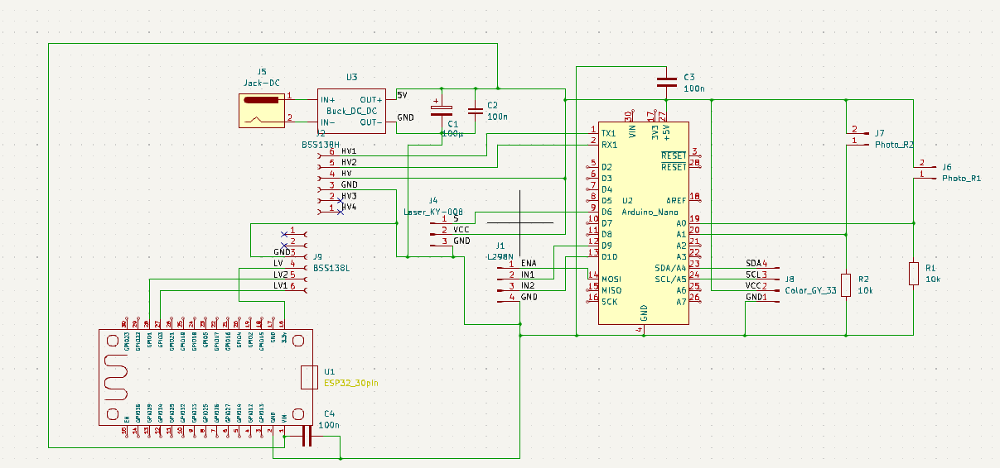
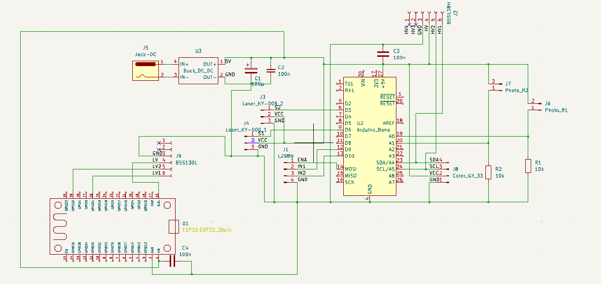
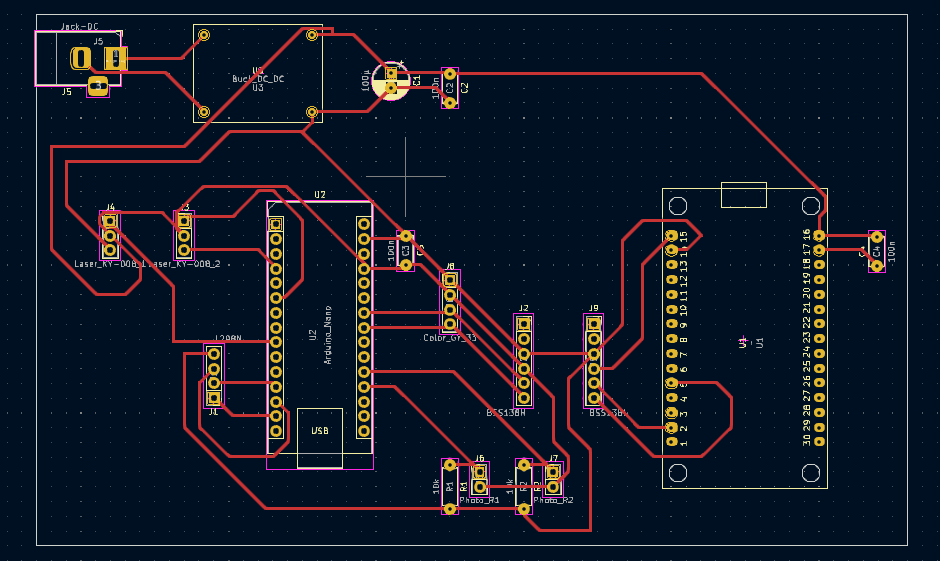

# 📝 Documentation - Test Final : Système de Contrôle pour Convoyeur de Tri

**Équipe IFRI Électronique :**
* Aretha FAGLA
* Hugues HANTAN
* Marielle AGBOSSOUNON
* Eunice ODJO
* Livingstone GBOZO

**Institution :** Institut de Formation et de Recherche en Informatique (IFRI), Université d’Abomey-Calavi
**Date :** 26 Juin 2025

## 📋 Table des matières

1. [Contexte & Objectifs](#1-contexte--objectifs)  
2. [Spécifications & Livrables](#2-spécifications--livrables)  
3. [Processus & Workflow](#3-processus--workflow)  
4. [Tâches & Étapes](#4-tâches--étapes)  
5. [Tests & Validation](#5-tests--validation)  
6. [Fichiers du Projet](#6-fichiers-du-projet)  
7. [Présentation des Résultats](#7-présentation-des-résultats)
8. [Ressources & Références](#8-ressources--références)  
9. [Annexes Techniques (Détails)](#9-annexes-techniques-détails)
10. [Conclusion](#10-conclusion)

---

## 1. Contexte & Objectifs

**Test Final – Système de Contrôle pour Convoyeur de Tri**  
Ce test final du **TEKBOT Robotics Challenge 2025** est une épreuve de synthèse multidisciplinaire. Notre rôle, en tant qu'équipe électronique, est de concevoir et de réaliser le "cerveau" et le "système nerveux" d'un convoyeur de tri automatisé.

Le projet consiste à développer un système électronique complet capable de piloter un convoyeur pour trier des objets (cubes de 30mm) en fonction de leur couleur (Vert, Jaune, Rouge, Bleu) et de fournir les données de tri en temps réel à une API web.

**Objectifs Spécifiques de l'Équipe Électronique :**
- **Développer une architecture électronique** robuste sur PCB (KiCad) pilotant les capteurs (présence, couleur) et un actionneur (moteur).
- **Implémenter une communication inter-microcontrôleurs** (I²C entre un ATmega328P et un ESP32) pour séparer la logique de contrôle temps réel de la connectivité réseau.
- **Développer des firmwares embarqués** structurés (machine à états) pour orchestrer l'ensemble du processus de tri de manière autonome.
- **Fournir une solution électronique "clé en main"**, testée et validée, prête à être interfacée avec le châssis du convoyeur et l'interface web.

---

## 2. Spécifications & Livrables

- **Microcontrôleurs** : Arduino Nano (ATmega328P) pour le contrôle, ESP32 pour la connectivité.
- **Protocole de Communication** : I²C (inter-MCU), Wi-Fi (vers le réseau).
- **Technologies** : KiCad 7, Arduino IDE, I²C.

**Livrables de l'Équipe Électronique :**  
<table>
  <thead>
    <tr><th>Livrable</th><th>Format</th><th>Chemin d'accès</th></tr>
  </thead>
  <tbody>
    <tr><td>Schéma Électronique Final</td><td><code>.kicad_sch</code></td><td><code>Documentation/test-final/elec/schematics/FinalTest_NanoEsp.kicad_sch</code></td></tr>
    <tr><td>Design PCB Final</td><td><code>.kicad_pcb</code></td><td><code>Documentation/test-final/elec/pcb/FinalTest_NanoEsp.kicad_pcb</code></td></tr>
    <tr><td>Firmware Contrôleur (Arduino Nano)</td><td><code>.ino</code></td><td><code>Documentation/test-final/elec/firmware/convoyeurArduino/</code></td></tr>
    <tr><td>Firmware Web API (ESP32)</td><td><code>.ino</code></td><td><code>Documentation/test-final/elec/firmware/convoyeurESP32/</code></td></tr>
  </tbody>
</table>

---

## 3. Processus & Workflow

Notre projet a suivi une démarche d'ingénierie structurée :

1.  **Phase de Conception** : Conception itérative du circuit sur KiCad (voir Annexe B), passant de l'UART à l'I2C avec une solution de conversion de niveau logique optimisée pour garantir la fiabilité. Définition de l'architecture logicielle (machine à états sur Nano, API REST sur ESP32) et du protocole de communication.
2.  **Développement Parallèle et Modulaire** : Développement des firmwares Nano et ESP32. Prototypage et test unitaire de chaque sous-système (détection couleur, commande moteur, API web).
3.  **Assemblage et Intégration** : Assemblage des composants électroniques sur une carte de prototypage, et câblage des périphériques (capteurs, driver moteur).
4.  **Calibration et Tests d'Intégration** : Calibration fine des capteurs (couleur, présence) et ajustement des paramètres de la machine à états pour un fonctionnement optimal.
5.  **Validation de bout en bout** : Test du système électronique complet pour valider la chaîne, du signal du capteur de présence à la fourniture des données sur l'API web.

---

## 4. Tâches & Étapes

<table>
  <thead>
    <tr><th>Étape</th><th>Responsable(s) Principal(aux)</th><th>Statut</th></tr>
  </thead>
  <tbody>
    <tr><td>Conception Schémas & PCB (KiCad)</td><td>Livingstone GBOZO & Eunice ODJO</td><td>✅ Terminé</td></tr>
    <tr><td>Développement Firmware (Nano & ESP32)</td><td>Hugues HANTAN & Livingstone GBOZO</td><td>✅ Terminé</td></tr>
    <tr><td>Assemblage Physique & Câblage</td><td>Aretha FAGLA, Marielle AGBOSSOUNON & Hugues HANTAN</td><td>✅ Terminé</td></tr>
    <tr><td>Tests & Calibration</td><td>Hugues HANTAN, Eunice ODJO & Livingstone GBOZO</td><td>✅ Terminé</td></tr>
  </tbody>
</table>

---

## 5. Tests & Validation

Le système a été validé à travers une série de tests fonctionnels.

<table>
  <thead>
    <tr><th>Test</th><th>Objectif</th><th>Critère de Validation</th><th>Résultat</th></tr>
  </thead>
  <tbody>
    <tr><td>Détection de Présence</td><td>Traiter les signaux des capteurs pour commander le moteur.</td><td>Le moteur est commandé au démarrage quand le laser 1 est coupé et à l'arrêt quand le laser 2 est coupé.</td><td>✅ Conforme</td></tr>
    <tr><td>Identification de Couleur</td><td>Identifier correctement les 4 couleurs.</td><td>Le système identifie la couleur du cube avec une précision > 95% après calibration.</td><td>✅ Conforme</td></tr>
    <tr><td>Communication I²C</td><td>Transmettre les données du Nano à l'ESP32 sans erreur.</td><td>L'ESP32 reçoit et interprète correctement les données de couleur et les compteurs.</td><td>✅ Conforme</td></tr>
    <tr><td>Validation de l'API Web</td><td>Fournir les données de tri via une API HTTP.</td><td>Le point d'API <code>/data</code> sur l'ESP32 renvoie un objet JSON valide avec les bonnes informations.</td><td>✅ Conforme</td></tr>
    <tr><td>Cycle de Tri Complet</td><td>Exécuter un cycle logique de tri de bout en bout de manière autonome.</td><td>Un cube simulé à l'entrée déclenche le cycle de détection, transport, identification, et les données sont prêtes sur l'API.</td><td>✅ Conforme</td></tr>
  </tbody>
</table>

---

## 6. Fichiers du Projet

L'ensemble des fichiers sources de notre projet (Électronique, Firmware) est organisé et disponible dans les dossiers correspondants du dépôt.

---

## 7. Présentation des Résultats

### 7.1 Conception Électronique (KiCad)

Le circuit a été conçu sur KiCad et intègre tous les composants sur un PCB unique pour une robustesse et une organisation optimales. L'évolution du design est détaillée en Annexe B.

| Schéma Électronique Final (V3) | PCB Final (V3) |
| :---: | :---: |
| 

 | 

 |
| *Figure 1 : Schéma électrique final avec I2C et convertisseur de niveau.* | *Figure 2 : Routage du PCB final.* |

 

    

 *Figure 3 : PCB final avec I2C et convertisseur de niveau. Vue 3D*

### 7.2 Prototype et Démonstration Fonctionnelle

Le système électronique a été assemblé pour validation. La vidéo et les images ci-dessous présentent un cycle complet de tri et les tests des fonctionnalités clés.

`[Placeholder pour la vidéo de démonstration finale]`

| Prototype Électronique | Test 1: Détection Présence | Test 2: Identification Couleur |
| :---: | :---: | :---: |
| 

 | `[Placeholder image/gif du cube coupant le faisceau]` | `[Placeholder image/gif du cube sous le capteur couleur]` |
| *Figure 4 : Le système de contrôle assemblé et câblé.* | *Figure 5 : Le Laser 1 détecte un cube et le firmware commande le moteur.* | *Figure 6 : Le système identifie un cube Rouge.* |

---

## 8. Ressources & Références

*   **Datasheets** : ATmega328P, ESP32, TCS34725 (GY-33), L298N, BSS138.
*   **Logiciels** : KiCad 7, Arduino IDE.
*   **Plateformes** : GitHub.

---

## 9. Annexes Techniques (Détails)

<strong>Cliquez pour déplier : Annexe A - Hardware et Schémas - L'Évolution de notre Conception Électronique</strong>

#### 1.1. Architecture Générale du Système Électronique
L'architecture électronique du système de convoyeur est conçue pour assurer l'automatisation complète du processus de tri des déchets. Elle intègre des capacités de détection de présence, d'identification de couleur, de contrôle moteur, et de communication sans fil pour un suivi en temps réel via une interface web.

Les principaux blocs fonctionnels de notre système électronique sont :
- L'Alimentation : Convertit l'énergie de la batterie en tensions stables nécessaires aux différents composants.
- Les Microcontrôleurs : Un duo Arduino Nano (ATmega328P) et ESP32 pour le traitement logique, le contrôle des périphériques et la connectivité réseau.
- Les Capteurs : Modules laser pour la détection de présence et un capteur de couleur pour l'identification des déchets.
- L'Actionneur : Un driver moteur contrôlant le moteur à courant continu du convoyeur.
- La Communication Inter-Microcontrôleurs : Une liaison I2C sécurisée entre l'Arduino Nano et l'ESP32.

#### 1.2. Composants et Fonctionnement Détaillé

##### 1.2.1. Unité de Traitement Principale (Arduino Nano - ATmega328P)
L'Arduino Nano, basé sur le microcontrôleur ATmega328P, constitue le cœur logique du système de tri. Il est responsable de l'acquisition des données des capteurs de présence (lasers/photorésistances) et du capteur de couleur. Il implémente l'algorithme de contrôle du moteur du convoyeur, déclenchant son mouvement en fonction de la détection des déchets et l'arrêtant pour l'identification. De plus, l'Arduino Nano agit comme maître sur le bus I2C, initiant la communication et transmettant les données de tri (couleur, compteurs) à l'ESP32.

Le choix de l'Arduino Nano est en parfaite adéquation avec le cahier des charges qui spécifie l'utilisation d'un microcontrôleur ATmega328P ou d'une carte Arduino Nano, évitant ainsi tout malus de notation. Sa compacité, sa facilité de programmation via l'IDE Arduino et le vaste support de sa communauté en font une plateforme robuste et efficace pour le développement rapide de projets embarqués.

Les broches clés utilisées sur l'Arduino Nano incluent les broches numériques pour l'interfaçage avec les modules laser et le driver moteur L298N, les broches analogiques pour les lectures des photorésistances, et les broches A4 (SDA) et A5 (SCL) dédiées à la communication I2C.

##### 1.2.2. Module de Communication et Interface Web (ESP32 Dev Kit v1)
Le module ESP32 Dev Kit v1 est spécifiquement intégré pour répondre à l'exigence d'une interface web de suivi en temps réel. Sa principale fonction est de gérer la connectivité sans fil (Wi-Fi) et d'héberger le serveur web qui affiche les quantités de déchets triés. L'ESP32 communique avec l'Arduino Nano en tant qu'esclave sur le bus I2C, recevant les données de comptage et d'identification de couleur pour les actualiser sur l'interface web.

La décision d'utiliser l'ESP32 est motivée par son module Wi-Fi intégré, indispensable pour la connectivité réseau du système. Sa capacité de traitement est amplement suffisante pour gérer simultanément le protocole I2C, le stack réseau Wi-Fi et les requêtes HTTP du serveur web.

Les connexions principales de l'ESP32 incluent son alimentation via VIN (5V), l'utilisation de sa broche 3V3 pour alimenter le côté basse tension du convertisseur de niveau logique, et les broches GPIO21 (SDA) et GPIO22 (SCL) pour la communication I2C.

##### 1.2.3. Convertisseur de Niveau Logique Bidirectionnel (Module BSS138)
Le module convertisseur de niveau logique, basé sur le transistor MOSFET BSS138, est un composant essentiel pour assurer une communication I2C fiable et sécurisée entre l'Arduino Nano (5V) et l'ESP32 (3.3V). Sa fonction est de traduire les signaux logiques bidirectionnellement entre ces deux domaines de tension distincts.

Sur notre PCB, ce module est intégré au moyen de deux connecteurs de type header femelle 1x06, identifiés comme J2 et J9. Ces footprints ont été dimensionnés spécifiquement pour accueillir un module breakout BSS138 du commerce, offrant une solution compacte et simplifiant l'intégration physique sur notre carte personnalisée.

    

**Fonctionnement et Justification du Choix Optimal :**
Le principe de fonctionnement de ce convertisseur repose sur l'utilisation de transistors MOSFET pour permettre une conversion de tension transparente et bidirectionnelle. Il est alimenté par deux sources de tension distinctes : le 5V (côté Haute Tension - HV) provenant du régulateur Buck DC-DC, et le 3.3V (côté Basse Tension - LV) fourni directement par l'ESP32.

Lorsqu'un signal de 3.3V est émis par l'ESP32, le convertisseur l'élève à 5V pour l'Arduino Nano. Cela garantit que le Nano perçoit un niveau logique haut clair (5V), offrant une marge de sécurité confortable de 2V par rapport à son seuil de détection (environ 3V). Inversement, lorsque l'Arduino Nano émet un signal de 5V, le convertisseur l'abaisse à 3.3V pour l'ESP32, protégeant ainsi ses broches GPIO qui opèrent en 3.3V natif. Le module intègre de surcroît ses propres résistances pull-up pour les lignes SDA et SCL, éliminant le besoin de composants externes. Cette solution est reconnue comme la plus robuste et la plus fiable.

Les connexions clés incluent l'alimentation du côté Haute Tension (HV) par le 5V et du côté Basse Tension (LV) par le 3.3V de l'ESP32. Les broches de données HV1/HV2 sont connectées aux broches SDA/SCL de l'Arduino Nano, et les broches LV1/LV2 sont connectées aux broches SDA/SCL de l'ESP32.

##### 1.2.4. Capteur de Couleur (Module GY-33)
Le module capteur de couleur GY-33 (TCS34725) identifie la couleur des déchets. Il mesure l'intensité lumineuse pour les composantes Rouge, Verte, Bleue (RVB) et les transmet à l'Arduino Nano via I2C. Une calibration préalable est nécessaire pour garantir la précision. Le module est connecté aux broches I2C (SDA/SCL) de l'Arduino Nano et alimenté en 5V.

##### 1.2.5. Capteurs de Présence (Modules Laser KY-008 et Photorésistances)
Deux modules Laser KY-008 et des photorésistances détectent les déchets. Lorsqu'un déchet coupe le faisceau, la résistance de la photorésistance augmente, créant une variation de tension lue par l'Arduino Nano.
- **Laser de Démarrage (J4)** : Déclenche le démarrage du moteur.
- **Laser de Zone de Détection (J3)** : Déclenche l'arrêt du moteur pour l'analyse de couleur.

##### 1.2.6. Contrôle du Moteur du Convoyeur (Driver L298N)
Le module L298N (pont en H) pilote le moteur DC. Il reçoit des signaux logiques du Nano (ENA, IN1, IN2) et fournit la puissance nécessaire au moteur à partir d'une alimentation externe, contrôlant la vitesse et la direction.

    

##### 1.2.7. Module d'Alimentation (Buck DC-DC - U3)
Le régulateur Buck DC-DC convertit la tension variable de la batterie Lithium en un 5V stable, essentiel pour l'Arduino Nano, les capteurs et la logique du driver.

##### 1.2.8. Condensateurs de Découplage (C1, C2, C3, C4)
Placés près des composants clés, ils filtrent le bruit et stabilisent les lignes d'alimentation, garantissant la fiabilité du système.

<strong>Cliquez pour déplier : Annexe B - Évolution de la Conception du PCB et Schémas</strong>

Le développement de notre système électronique a suivi un processus itératif.

##### 1.3.1. Version 1 : Schéma avec Liaison UART
- **Description** : La première itération privilégiait une communication série UART entre l'Arduino Nano et l'ESP32.
- **Schéma** : 

- **PCB Associé** : 
- **Abandon** : Complexité logicielle trop élevée sur l'Arduino Nano, qui ne tirait pas pleinement parti des capacités de l'ESP32.

##### 1.3.2. Version 2 : Schéma avec I2C et Résistances Pull-up Simples
- **Description** : Migration vers le protocole I2C. Tentative de gestion de la différence de tension (5V/3.3V) avec de simples résistances pull-up de 4.7kΩ connectées au 3.3V.
- **Schéma** : 

    

- **Abandon** : Analyse technique révélant une marge de sécurité trop faible pour l'Arduino Nano (0.3V), rendant le système potentiellement vulnérable au bruit électrique et compromettant la fiabilité à long terme.

##### 1.3.3. Version 3 (Finale) : Schéma avec I2C et Convertisseur de Niveau Dédié
- **Description** : Solution finale et la plus robuste, utilisant un convertisseur de niveau logique dédié (BSS138) pour une communication I2C inter-tensions fiable.
- **Schéma** : 
- **PCB Final** : 
- **Optimisation du PCB** : Le design a été optimisé avec des pistes d'alimentation larges, un routage court et direct, et un placement logique des composants. Un contrôle des règles de conception (DRC) a été effectué pour garantir l'absence d'erreurs.

<strong>Cliquez pour déplier : Annexe C - Gestion de l'Alimentation et des Câbles</strong>

#### 1.4. Gestion et Sécurité de l'Alimentation
- **Source** : Bloc de batteries Lithium via un Jack DC (J5).
- **Régulation** : Module Buck DC-DC (U3) pour un 5V stable et précis.
- **Stabilité** : Condensateurs de découplage pour filtrer le bruit.
- **Protection** : Convertisseur de niveau logique pour protéger les broches des microcontrôleurs.

#### 1.5. Gestion des Câbles
La conception du PCB facilite une gestion propre des câbles. Les connecteurs sont positionnés pour minimiser les longueurs. L'intégration sur un seul PCB réduit l'encombrement et le risque d'erreurs par rapport à une solution sur breadboard.

<strong>Cliquez pour déplier : Annexe D - Firmware (Code) - Le Cœur Logiciel</strong>

#### 2.1. Firmware Arduino Nano (Maître)
Le code est structuré autour d'une **machine à états finis** pour une gestion claire du processus.
- **Architecture** : Définition des broches, fonctions de contrôle moteur, fonctions de lecture capteurs, fonctions de calibration et d'identification de couleur, et fonction de communication I2C.
- **Machine à États (`ConveyorState`)** : Gère le flux du processus à travers les états : `WAITING_FOR_CUBE`, `MOVING_TO_COLOR_SENSOR`, `MEASURING_COLOR`, `MOVING_TO_COLLECTION_POINT`, et `AT_COLLECTION_POINT`.
- **Calibration** : Une fonction `calibrateColorSensor()` guide l'utilisateur pour calibrer le capteur avec chaque couleur, assurant la précision dans les conditions réelles.

#### 2.2. Firmware ESP32 (Esclave et Web API)
L'ESP32 agit comme un esclave I2C et un serveur web qui expose une API REST.
- **Architecture** : Paramètres Wi-Fi, adresse I2C, et variables `volatile` pour les compteurs mis à jour par l'interruption I2C.
- **Communication I2C** : La fonction `receiveEvent()` est un callback qui se déclenche à la réception de données du Nano et met à jour les compteurs.
- **Serveur Web et API** : L'ESP32 initialise un serveur HTTP et expose un point d'API `/data`. Lorsqu'il est interrogé, il renvoie un objet JSON avec les derniers compteurs, permettant au frontend de se mettre à jour.

<strong>Cliquez pour déplier : Annexe E - Instructions d'Utilisation et de Calibration</strong>

#### 3.1. Démarrage et Calibration Initiale
1.  **Câblage** : Vérifier le câblage selon le schéma final.
2.  **Téléversement** : Flasher le code sur le Nano, puis sur l'ESP32 (après avoir configuré le Wi-Fi).
3.  **Vérification IP** : Noter l'adresse IP de l'ESP32 via le Moniteur Série.
4.  **Calibration Couleur** : Suivre les instructions sur le Moniteur Série du Nano pour calibrer le capteur avec un objet blanc puis chaque cube de couleur.

#### 3.2. Calibration des Paramètres de Fonctionnement (Variables à Ajuster)
Les variables suivantes dans le code du Nano permettent un réglage fin :
- `motorSpeedPWM` : Vitesse du moteur (0-255).
- `motorRunDuration_Start` : Durée du mouvement initial (en ms).
- `laserThreshold_1`, `laserThreshold_2` : Seuils de détection des lasers (0-1023).
- `COLOR_MATCH_THRESHOLD` : Tolérance pour la reconnaissance de couleur.

#### 3.3. Surveillance des Statistiques (Frontend Vercel)
1.  **Accès** : Ouvrir l'URL du frontend : `https://convoyeur-front-r5y5.vercel.app/`
2.  **Configuration** : Mettre à jour l'URL de l'API dans le code du frontend avec l'IP de votre ESP32.
3.  **Observation** : Les compteurs se mettent à jour en temps réel.

---

## 10. Conclusion

Ce projet final a mis en évidence notre capacité à mener un projet électronique complexe de bout en bout. De la conception itérative d'un PCB robuste à la programmation de firmwares embarqués communicants, nous avons transformé les exigences du cahier des charges en une solution matérielle et logicielle intégrée. Ce système de contrôle démontre notre maîtrise des capteurs, des actionneurs et des protocoles de communication, piliers fondamentaux de tout système robotique moderne et résilient.